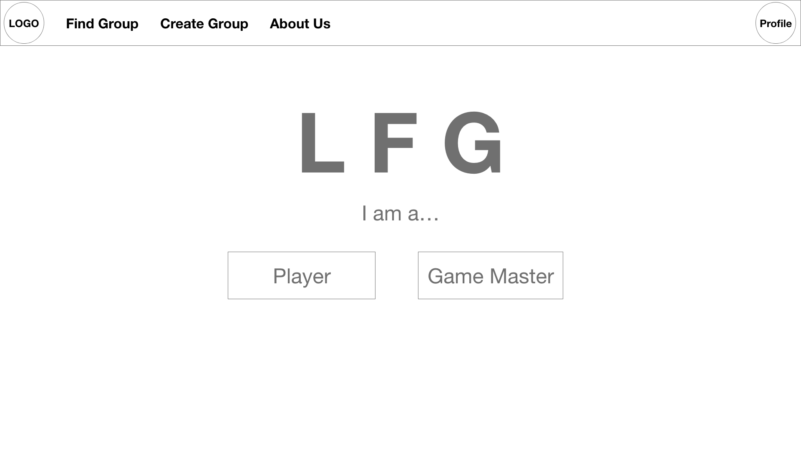

# Interaction Design

## Wireframe
From the personas and scenarios, many of the personas we came up with were busy, working individuals with more limited free time. Because of this, we tried to make sure that finding and connecting with a group was as smooth and fast as possible. Furthermore, in the focus group, the lowest amount of time one person was willing to spend looking for a group was 30 minutes, as they already are in a consistent group. To meet this need, we made a simple wizard and group finder based on several categories so they can find potential groups as fast as possible. For a new player who also responded in the focus group, they were willing to spend considerably more time to make sure they had a good group, and sorting by beginner friendly and slowly reading campaign descriptions to get a good feel for what is expected of them and what kind of game they will play.

One of the **most** requested features in both the focus group and interviews was to have a system in place to track availability...

  text text text text
  

