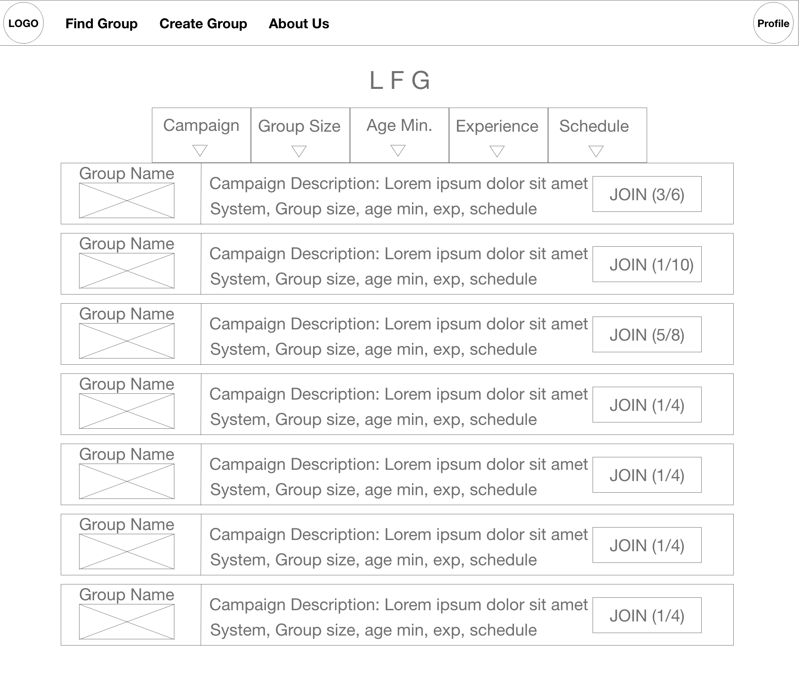
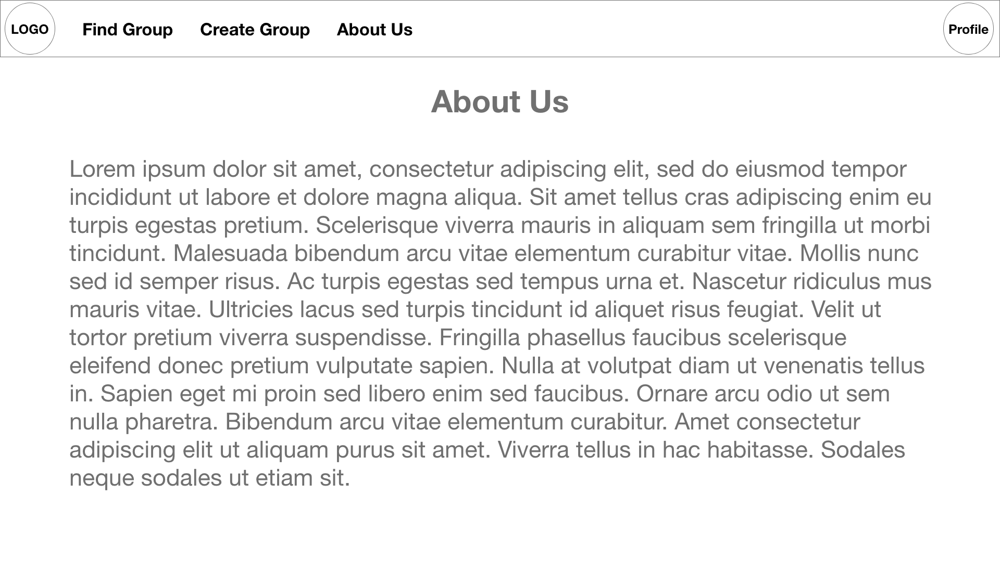

# Interaction Design

## Wireframe
From the personas and scenarios, many of the personas we came up with were busy, working individuals with more limited free time. Because of this, we tried to make sure that finding and connecting with a group was as smooth and fast as possible. Furthermore, in the focus group, the lowest amount of time one person was willing to spend looking for a group was 30 minutes, as they already are in a consistent group. To meet this need, we made a simple wizard and group finder based on several categories so they can find potential groups as fast as possible. For a new player who also responded in the focus group, they were willing to spend considerably more time to make sure they had a good group, and sorting by beginner friendly and slowly reading campaign descriptions to get a good feel for what is expected of them and what kind of game they will play.

One of the **most** requested features in both the focus group and interviews was to have a system in place to track availability...
 
# **Home Page**

* Our goal with the home page was to create a simplistic and clean experience for a user with any feasible goal can get to their desired location efficiently.

* With that in mind, we created the two very visible "Player" and "Game Master" buttons, which will subsequently take you to the find group and create group pages. If the user is already logged in, they can just do this one simple click and complete their desired goal.

* Additionally, the navigation bar at the top allows you to visit either of those pages, as well as the profile page to view their account information. Throughout using the site, our goal is to allow the user to get to anywhere within 1-2 clicks of their current location.

# **Find Group Page**

* The biggest factor that puts our tabletop rpg game finder above the other current options is the ease of access and customizability of game filters.

* In our questionnaire, as well as our focus group, we found that almost all users had the most difficulties in their tabletop rpg gaming experience when it came to forming/joining groups. With that in mind, we wanted to have the full list of available games in one place (the Find Groups page) with filters that can be fine-tuned to the user's liking.

* The user should also be able to request to join a desired group in one click, as pictured by the "JOIN" button on the right side of each group widget.

# **Create Group Page**

* The Create Group page focuses on allowing the Game Master to create a post that includes all of the important information related to their Campaign and group rules/settings. However, we do not want the Game Master to be overwhelmed by options and information to fill out when creating a game. A fine-tuned balance of customizability without being overwhelmed is what our end-goal is.

* In particular, the "weekly availability" clickable calendar is an important aspect of finding this balance. It can also make it much easier for the GM instead of forcing them to manually figure out a weekly schedule with their group.

# **About Us Page**

* This page is a simple page available through the navbar to find additional information about the goals of the site and what we hope to accomplish with this product. Additionally, it provides credit to both the developers and the UX Designers.

# **Profile Page**

* Our mindset for the profile page was to create a "hub" of sorts for users to perform actions related to their game groups.

* A GM should be able to quickly access the requests list for any of their created groups that have not completely filled with players yet. Any player that has been accepted into a group should also be able to quickly access the view for that group ("Go to group" button). There, they can see the game schedule and chat with other members.

* We took a similar approach to editing a user's profile information, taking already existing conventions and applying them here to create a more comfortable environment for users.

# **Group View Page**

* In our Group View Page, we had two major goals:

* Firstly, we want the schedule that the Game Master set during the Create Group stage of the process to appear again here, so that players in the group can access it at any time.  The GM should also be able to make changes to this schedule when necessary.

* Secondly, the group members should be able to chat with one another to discuss anything related to the group. This communication should benefit the experience overall and allow for any clarifications. Additionally, this will prevent players from being forced to disclose information about one another, such as their phone number, which could lead to player safety issues.

# **Requests Page**

* When a user requests to join a campaign on the "find groups" page, the Game Master of that particular group will be sent a request that can be found on this page.

* After hearing feedback from our focus group, we realized the importance of allowing GM's to know as much useful information as possible about these possible incoming members. Not only should things such as Username, experience level, and age be available, but their user rating as well. The user rating system would allow GM's to quickly find quality players that wish to join their campaign.

* GM's can either reject or accept each group join request by simply clicking the reject/accept button respectively.
